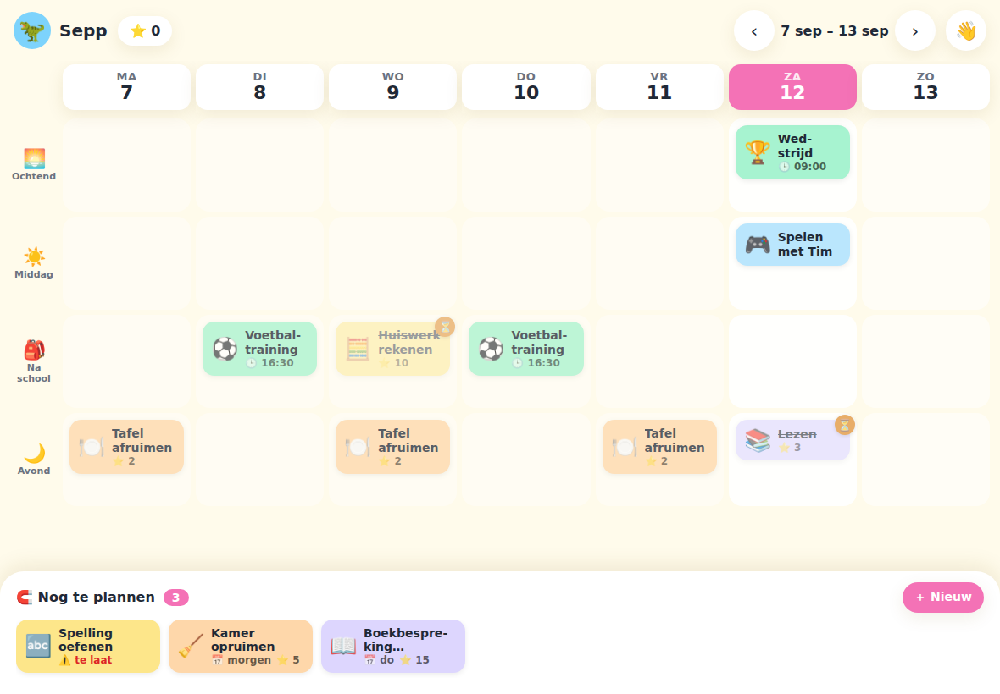

# Planner

Speelse weekplanner voor kinderen, self-hosted. Ouders zetten taken met een deadline
op de stapel, de kinderen slepen ze zelf naar een dagdeel, vinken af, sparen punten
en wisselen die in. Draait als één container op het thuisnetwerk; werkt op iPad,
computer en als wanddashboard.

Ontwerp: `docs/superpowers/specs/2026-09-12-kinderplanner-design.md`.



Meer schermen in `docs/screenshots/`.

## Starten (Docker, bijv. in een LXC op Proxmox)

```bash
git clone <repo> planner && cd planner
docker compose up -d --build
```

Open `http://<host>:3000`. De database staat in `./data/planner.db`.

Eerste keer: profielen Sepp, Liz, Papa en Mama staan klaar, plus het vaste profiel
**Gezin** 🏠 voor familie-evenementen (verjaardagen, vakantie, uitjes). Kaarten op
Gezin staan op ieders bord, alleen te bekijken. Ouders hebben ook een eigen bord.
De ouder-pincode is `1234`; wijzig die via Ouderpaneel → Gezin → ✏️.

## Op de iPad als app

Open de site in Safari → Delen → **Zet op beginscherm**. De planner opent dan
zonder browserbalken. Voor het wanddashboard, alleen-lezen en zonder login,
ververst zichzelf elke minuut:

- `http://<host>:3000/#/gezin` — hele week, een rij per gezinslid
- `http://<host>:3000/#/overzicht` — vandaag per gezinslid

## Ontwikkelen

```bash
cd backend && npm install && npm run dev      # API op :3000, database in backend/data/
cd frontend && npm install && npm run dev     # UI op :5173, proxied naar :3000
cd backend && npm test                        # 95 tests, in-memory SQLite
```

Vereist Node 24 (gebruikt de ingebouwde `node:sqlite`).

## Apple-gezinsagenda koppelen (alleen lezen)

Afspraken uit een iCloud-agenda verschijnen als alleen-lezen kaarten met een
-badge. Zonder tag komen ze op Gezin en dus op ieders bord. Elk gezinslid heeft
een **agenda-tag** (Ouderpaneel → Gezin → ✏️), bijvoorbeeld `s` voor Sepp. Zet die
tussen haakjes achter de titel in Apple: `Voetbal (s)`. Meerdere tegelijk kan met
`(s,l)`, `(l & e)` of `(s)(l)`; een volledige naam `(Sepp)` werkt ook. Haakjes die
geen tag zijn, zoals `(KSV)`, blijven gewoon in de titel staan.

1. Maak een app-specifiek wachtwoord op https://account.apple.com → *Inloggen en
   beveiliging* → *App-specifieke wachtwoorden*. Dit kun je altijd intrekken.
2. Kopieer `.env.example` naar `.env` en vul `CALDAV_USER` (je Apple ID),
   `CALDAV_PASSWORD` (het app-specifieke wachtwoord) en `CALDAV_CALENDARS` in. Dat is een
   lijst van agenda's met een standaardbestemming voor afspraken zonder tag, bijvoorbeeld
   `Family=gezin,Sepp en Liz=Sepp+Liz`: de gezinsagenda naar Gezin, de kinderagenda naar
   beide kinderen. Tags achter de titel gaan altijd voor.
3. `docker compose up -d --build`. Het ouderpaneel → Gezin toont de status en een
   knop *Nu synchroniseren*. De planner haalt elke 10 minuten op, van vorige week tot
   acht weken vooruit.

Tijd bepaalt het dagdeel: vóór 12 uur ochtend, tot 15 uur middag, tot 18 uur na
school, daarna avond. Hele-dag- en meerdaagse afspraken staan bovenaan elke dag.
Geïmporteerde afspraken krijgen de kleur van het bord waarop ze staan en een icoon
op basis van trefwoorden (voetbal ⚽, tandarts 🦷, verjaardag 🎂). Via het kaartpaneel
kies je een ander icoon; dat geldt dan voor alle afspraken met dezelfde titel op dat
bord. Afvinken kan, maar telt niet mee voor streak of punten; het zijn geen taken.

## Huiswerkhulp (AI die helpt, niet voordoet)

Kinderen chatten via 💬 Hulp op hun bord of "Hulp nodig?" op een kaart met een
huiswerkhulp die vragen terugstelt en hints geeft, maar nooit het antwoord of een
in te leveren tekst. De regels staan in `tutor/basis.md`, per kind aangevuld met
`tutor/<naam>.md`. Ouders lezen alle gesprekken terug in Ouderpaneel → Huiswerkhulp,
zetten per kind een dagplafond, kiezen de motor (Claude Code of Codex CLI) en kunnen
extra instructies toevoegen zonder herbouw. Geen API-tokens: de motor draait onder
het abonnement van de ouder op de host.

Onderdelen:
- `tutor-bridge/`: klein tussenstuk op de host (Node, geen dependencies) dat `claude -p`
  of `codex exec` aanroept met alle tools uit, in een lege werkmap. Draait als
  systemd-service `tutor-bridge` onder `/opt/tutor-bridge`, configuratie in
  `/etc/tutor-bridge.env` (geheim, poort, werkmap, modellen, `CLAUDE_CONFIG_DIR`).
- Planner: `TUTOR_BRIDGE_URL=http://host.docker.internal:3100` en hetzelfde
  `TUTOR_SECRET` in `.env`; compose geeft de container toegang tot de host.

Installatie op een nieuwe host:

```bash
npm install -g @anthropic-ai/claude-code @openai/codex   # of één van de twee
claude login && codex login --device-auth                # eenmalig, als de gebruiker die de service draait
mkdir -p /opt/tutor-bridge /var/lib/tutor-bridge/work && cp tutor-bridge/*.mjs tutor-bridge/package.json /opt/tutor-bridge/
# /etc/tutor-bridge.env met TUTOR_SECRET=<lang geheim>, TUTOR_PORT=3100, TUTOR_WORKDIR=/var/lib/tutor-bridge/work
# systemd-unit: ExecStart=node /opt/tutor-bridge/server.mjs, EnvironmentFile=/etc/tutor-bridge.env
systemctl enable --now tutor-bridge && curl localhost:3100/health
```

Na een wijziging in `tutor-bridge/`: bestanden opnieuw kopiëren en `systemctl restart tutor-bridge`.
Na een wijziging in `tutor/*.md`: container herbouwen (de map zit in de image).

## Home Assistant

Publiek leesbare endpoints, geen token nodig:

- `GET /api/kids/:id/summary` → `{name, balance, streak, todayTotal, todayDone, pendingApprovals}`
- `GET /api/overview?date=YYYY-MM-DD` → kaarten van die dag per gezinslid
- `GET /api/family-week?start=YYYY-MM-DD` → hele week per gezinslid

Voorbeeld REST-sensor in `configuration.yaml`:

```yaml
rest:
  - resource: http://planner.lan:3000/api/kids/1/summary
    scan_interval: 300
    sensor:
      - name: "Sepp punten"
        value_template: "{{ value_json.balance }}"
      - name: "Sepp vandaag klaar"
        value_template: "{{ value_json.todayDone }}/{{ value_json.todayTotal }}"
      - name: "Sepp streak"
        value_template: "{{ value_json.streak }}"
```

## API in het kort

Alles onder `/api`, JSON. Inloggen met `POST /login {profileId, pin?}` geeft een
token voor `Authorization: Bearer`. (O) = alleen ouders.

| Route | Doel |
|---|---|
| `GET /profiles` | gezinsleden (publiek, zonder pins) |
| `POST/PATCH/DELETE /profiles` (O) | gezin beheren |
| `GET /kids/:id/week?start=maandag` | weekbord: geplande kaarten, stapel, saldo, streak |
| `POST /cards`, `PATCH /cards/:id`, `DELETE /cards/:id` | kaart maken, verplaatsen, bewerken |
| `POST /cards/:id/done` `/undone` | afvinken |
| `POST /cards/:id/approve` `/reject` (O) | punten goedkeuren |
| `GET/POST/PATCH/DELETE /recurrences` (O) | wekelijkse items |
| `GET /rewards`, `POST/PATCH/DELETE /rewards` (O) | winkeltje |
| `POST /redemptions {rewardId}` | kind wisselt in |
| `POST /redemptions/:id/approve` `/deny` (O) | inwisselen afhandelen |
| `GET /approvals` (O) | alles wat wacht op een ouder |
| `GET /overview?date=` | dagoverzicht hele gezin (publiek) |
| `GET /family-week?start=maandag` | weekoverzicht hele gezin (publiek) |
| `GET /sync/status`, `POST /sync/now` (O) | status van en handmatig starten van de agenda-sync |
| `GET/POST /tutor/:kidId/conversations`, `GET /tutor/conversations/:id`, `POST .../messages` | huiswerkhulp: gesprekken en berichten |
| `GET/PATCH /tutor/settings/:kidId`, `GET /tutor/status` (O) | plafond, motor, extra instructies, status |
| `GET /kids/:id/summary` | cijfers voor Home Assistant (publiek) |

## Regels

- Een kind ziet en beweegt alleen eigen kaarten. Kaarten van een ouder mag het
  kind verplaatsen en afvinken, niet aanpassen of weggooien.
- Punten geeft alleen een ouder. Afvinken van een kaart met punten wacht op een ✓
  van een ouder; zonder punten telt het direct.
- Streak: dagen op rij waarop alles wat gepland stond ook is afgevinkt.
- Inwisselen reserveert punten tot een ouder goedkeurt of afwijst.
